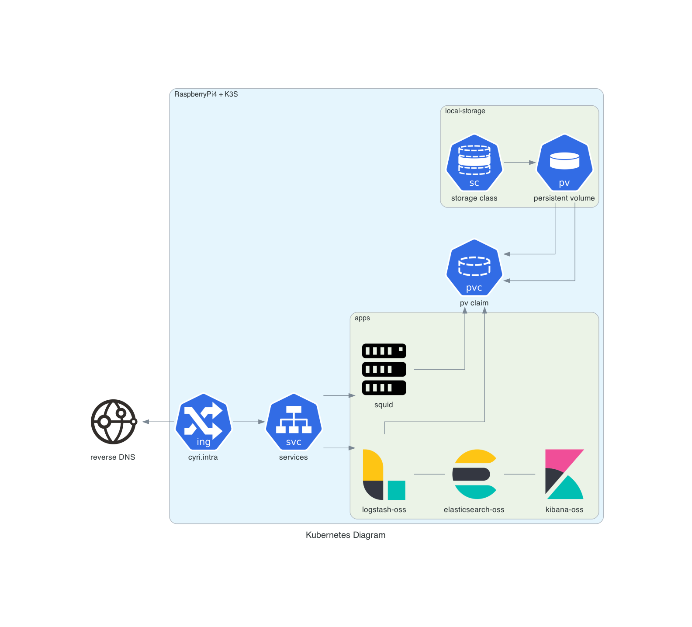

# Project Description

The goal of the project is to setup a proxy appliance for monitoring the internal home web activities.

The purpose is to install a light Kubernetes (k3s) cluster on [**Raspberry Pi 4**](https://www.raspberrypi.org) (armv8) and then to deploy Squid and the open source ELK stack: ElasticSearch, Logstash and Kibana. 

### Updates

| Date | Description |
| --- | --- |
| March 2020 | project launch |
| February 2021 | add configmaps and ingress |
| March 2022 | update of Squid image to 4.10, split ELK stack to 3 pods, update of ELK stack images from Elastic registry (incl. [CVE-2021-44228](https://cve.mitre.org/cgi-bin/cvename.cgi?name=2021-44228)) |


### Installing and configuring the setup

The project contains 2 folders:

* folder ***squid*** contains the *Dockerfile* to build the ARM64 (aarch64)  Squid image based on Ubuntu. Also the full YAML files for deploying the application based on the Squid config file and the related exposed service, configmaps.
* folder ***elk*** contains the YAML for creating the deployment with ElasticSearch, Logstach and Kibana. Also, the related config files for ELK such as the *grok* instructions to parse the Squid logs. Finally, the images used for the ELK stack are the ones provided by [Elastic](https://www.docker.elastic.co/).

### Running the project

#### Prerequisites
- Ensure that your Raspberry Pi 4 (RPI4) runs with 64 bits OS such as Ubuntu Server [**https://ubuntu.com/download/raspberry-pi**](https://ubuntu.com/download/raspberry-pi). For my setup, I selected the LTS release: ***Ubuntu 20.04.3 LTS***.
- Read the matrix compliancy: [**https://www.elastic.co/fr/support/matrix**](https://www.elastic.co/fr/support/matrix)
- Verify the k3s requirements: [**https://rancher.com/docs/k3s/latest/en/installation/installation-requirements/**](https://rancher.com/docs/k3s/latest/en/installation/installation-requirements/)

#### Installation

Follow the steps:

1. Install RPI4 as described on the [**Ubuntu**](https://ubuntu.com/download/raspberry-pi/thank-you) documentation for Raspberry Pi.
2. Install Docker to build the [Squid image](squid/centos7/README.md) for ARM64 or pull the image from [**my Docker hub repositories**](https://hub.docker.com/r/cyrriv/)
    * Instructions to install docker-ce: [**docker-ce**](https://docs.docker.com/install/linux/docker-ce/ubuntu/)
3. Install **k3s** with the shell script: 
    [**https://rancher.com/docs/k3s/latest/en/installation/install-options/**](https://rancher.com/docs/k3s/latest/en/installation/install-options/)
    ``` 
    sudo curl -sfL https://get.k3s.io | sh -
    ``` 

    * After successful installation, list the k8S node:
        ``` 
        sudo kubectl get nodes
        ``` 
        The command returns the list of node, here only the master node:
         ``` 
        ubuntu@cyri-pi4:~$ sudo kubectl get nodes
        NAME       STATUS   ROLES                  AGE    VERSION
        cyri-pi4   Ready    control-plane,master   341d   v1.20.0+k3s2
         ``` 

#### Quickstart

Follow the steps:

1. To deploy Squid, launch the *kubectl* commands:
    ```
    sudo kubectl create -f ./squid/pvc.yaml             # Create the Persitent Volume
    sudo kubectl create -f ./squid/configmap-squid-*    # Create all ConfigMaps
    sudo kubectl create -f ./squid/deployment.yaml      # Deploy Squid (app and service)
    ```
2. To deploy ELK, launch the *kubectl* commands in this order:
    ```
    sudo kubectl create -f ./elk/configmap-elasticsearch-conf.yaml  # Create ConfigMaps for ElasticSearch
    sudo kubectl create -f ./elk/deploy-elasticsearch.yaml          # Deploy and expose ElasticSearch
    sudo kubectl create -f ./elk/configmap-logstash-conf.yaml       # Create ConfigMaps for Logstash
    sudo kubectl create -f ./elk/deploy-logstash.yaml               # Deploy and expose Logstash
    sudo kubectl create -f ./elk/configmap-kibana-conf.yaml         # Create ConfigMaps for Kibana
    sudo kubectl create -f ./elk/deploy-kibana.yaml                 # Deploy and expose Kibana
    ```
    **NOTE**: The Elastic index mapping creation may fail the pod startup. To get ride of this, the pod may restart at least once to ensure that ElasticSearch is up and running to accept the CURL command.

3. Finally, the command *kubectl get all,pv,pvc,configmaps,ingress* returns all resources status.
    
    

## Issues encountered and problems solving

* K3s fails to start with the fatal error:
    ```
    FATA[2020-03-14T15:40:30.660878233Z] failed to find memory cgroup, you may need to add "cgroup_memory=1 cgroup_enable=memory" to your linux cmdline (/boot/cmdline.txt on a Raspberry Pi)
    ```
    - Solution: under Ubuntu 18.04, the boot file to amend is located under */boot/firmware/nobtcmd.txt*. Update it by adding "cgroup_memory=1 cgroup_enable=memory" at the end of the file. Then reboot your RPI4. Finally check that changes are ok by running the command: 
        ```
        sudo cat /proc/cmdline.
        ```
* ElasticSearch *config* folder is read-only when using configMap
    ````
    Exception in thread "main" java.nio.file.FileSystemException: /usr/share/elasticsearch/config/elasticsearch.keystore.tmp: Read-only file system
    ````
    - Solution: use *subPath* when defining the *volumeMounts* as explained in this [Stackoverflow QA](https://stackoverflow.com/questions/57373670/elasticsearch-yml-is-read-only-when-loaded-using-kubernetes-configmap)
    ````yaml
    ....
    volumeMounts:
        - name: elasticsearch-conf
            mountPath: /usr/share/elasticsearch/config/elasticsearch.yml
            subPath: elasticsearch.yml
        - name: elasticsearch-jvm
            mountPath: /usr/share/elasticsearch/config/jvm.options
            subPath: jvm.options
    ....
    ````


## Tips and tricks

* Add rules in iptables for openning default ports exposing pods on the K8S cluster:
    ```
    sudo iptables -A INPUT -i eth0 -p tcp -s 192.168.0.0/24 --dport 30000:32767 -m conntrack --ctstate NEW,ESTABLISHED -j ACCEPT
    sudo iptables -L --line-numbers
    sudo iptables -A OUTPUT -o eth0 -p tcp --sport 30000:32767 -m conntrack --ctstate ESTABLISHED -j ACCEPT
    sudo iptables-save
    ```

* Health check of k3s by running the command
    ```
    sudo k3s check-config
    ```
    The command returns the overall configuraton state of k3s.

* Restart k3s:
    ```
    sudo systemctl restart k3s
    sudo systemctl status k3s
    ```
* Upgrade k3s cluster:
    ```
    sudo curl -sfL https://get.k3s.io | sh -
    ```
* Enable the Traefik Dashboard
    ```
    kubectl -n kube-system edit configmap traefik
    ```
    By default the dashboard is disabled but you can enable by
    adding these lines in th traefik.toml configmap.
    ````
    [api]
      dashboard = true
      insecure = true
    ````
    Delete the Traefik pod to ensure it re-read the updated configmap.

* Enable the Kubernetes Dashboard
    
    Instructions for enabling it: [**https://kubernetes.io/docs/tasks/access-application-cluster/web-ui-dashboard/**](https://kubernetes.io/docs/tasks/access-application-cluster/web-ui-dashboard/)
    
